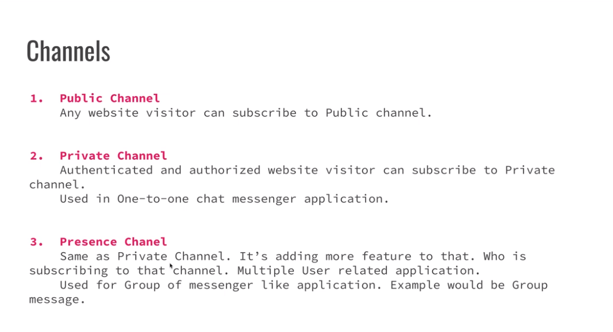

# How to setup

## setup breeze

```
composer require laravel/breeze --dev
```

```
php artisan breeze:install

php artisan migrate
npm install
npm run dev
```

## setup Websocket

```
composer require beyondcode/laravel-websockets
```

```
php artisan vendor:publish --provider="BeyondCode\LaravelWebSockets\WebSocketsServiceProvider" --tag="migrations"
```

```
php artisan migrate
```

```
php artisan vendor:publish --provider="BeyondCode\LaravelWebSockets\WebSocketsServiceProvider" --tag="config"
```

```
php artisan websockets:serve
```

## config the ENV

```
BROADCAST_DRIVER=pusher
CACHE_DRIVER=file
FILESYSTEM_DISK=local
QUEUE_CONNECTION=sync
SESSION_DRIVER=file
SESSION_LIFETIME=120

PUSHER_APP_ID=LARAVELCHAT
PUSHER_APP_KEY=LARAVELCHATXYZ
PUSHER_APP_SECRET=LARAVELCHATXYZABC
PUSHER_HOST='127.0.0.1'
PUSHER_PORT=6001
PUSHER_SCHEME=http
PUSHER_APP_CLUSTER=mt1
```

## how to create a custom event

```
php artisan make:event MessageSent
```

## Laravel Echo and Client side setup

```
npm install --save-dev laravel-echo pusher-js
```

## Receiving Broadcasts

-   using it `resources\js\app.jsx`

```
Echo.channel(`orders.${this.order.id}`)
    .listen('messenger', (e) => {
        console.log(e.order.name);
    });
```

## Chat Applcation Public, Private and Presence Channel In Laravel Broadcasting



-   put it to `app\Events\MessagesSent.php`

```php
public function broadcastOn()
{
    return new PrivateChannel('messenger');
}
```

-   put it to `routes\channels.php`

```php

Broadcast::channel('messenger', function ($user) {
    return !is_null($user);
});

```

-   put it to `resources\js\app.jsx`

```php
Echo.private(`messenger`)
.listen("MessagesSent", (e) => {
        console.log(e);
    }
);
```

## Set the CSRF token

-   put it `resources\views\app.blade.php`

```
<!-- CSRF Token -->
<meta name="csrf-token" content="{{ csrf_token() }}">
```

-   also including the Auth middleware in api `routes\api.php`

```
Broadcast::routes(['prefix' => 'api','middleware' => ['auth:api']]);
```

## Group Message

-   put it `app\Events\GroupChatMessage.php`

```
public function broadcastOn()
{
    return new PresenceChannel('group_chat.'. $this->message->group_id);
}
```

-   config the channel `routes\channels.php`

```
Broadcast::channel('messenger', function ($user) {
    return !is_null($user);
});

Broadcast::channel('group_chat.{roomId}', function ($user, $roomId) {
    if (true) {
        return ['id' => $user->id, 'name' => $user->name];
    }
});
```

## Messenger Chat Application Chat UI Design

```
import AuthenticatedLayout from "@/Layouts/AuthenticatedLayout";
import { Head } from "@inertiajs/react";

export default function Chat({ auth }) {
    return (
        <AuthenticatedLayout
            user={auth.user}
        >
            {/* <Head title="Chat" /> */}

            <div className="">
                {/* <div className="max-w-7xl mx-auto sm:px-6 lg:px-8">
                    <div className="bg-white overflow-hidden shadow-sm sm:rounded-lg">
                        <div className="p-6 text-gray-900">Messanger</div>
                    </div>
                </div> */}

                <div className="messenger h-screen overflow-hidden bg-slate-400 p-4">
                    <div className="flex">
                        <div className="basis-2/6 border-r border-slate-100 bg-white pt-3">
                            <div className="search-box h-10 text-slate-300">
                                <div className="flex justify-between border-b border-slate-100 px-5 pb-1">
                                    <form action="">
                                        <i className="fa fa-search"></i>
                                        <input
                                            type="search"
                                            className="font-light border-0 hover:border-0 focus:border-0 shadow-none focus:!outline-none focus:ring-0"
                                            placeholder="search"
                                        />
                                    </form>
                                    <div className="">
                                        <button className="relative">
                                            <i className="fa fa-message"></i>
                                            <i className="fa fa-plus absolute -top-2 text-sm"></i>
                                        </button>
                                    </div>
                                </div>
                            </div>

                            <div className="user-list h-screen overflow-y-auto">
                                <div className="flex px-5 py-3 transition hover:cursor-pointer hover:bg-slate-100">
                                    <div className="pr-4">
                                        
                                    </div>
                                    <div>
                                        <h3 className="text-md text-violet-500">
                                            Tahsin
                                        </h3>
                                        <p className="h-5 overflow-hidden text-sm font-light text-gray-400">
                                            Lorem ipsum dolor sit amet
                                            consectetur,
                                        </p>
                                    </div>
                                </div>
                            </div>
                        </div>
                        <div className="basis-4/6">
                            <div className="user-info-header bg-white px-5 py-3">
                                <div className="flex justify-between">
                                    <div className="flex items-center">
                                        
                                        <h3 className="text-md pl-4 text-gray-400">
                                            Tahsin
                                        </h3>
                                    </div>
                                    <div className="">
                                        <i className="fa fa-message text-violet-300"></i>
                                        <i className="fa fa-video ml-3 text-gray-300"></i>
                                        <i className="fa fa-phone ml-3 text-gray-300"></i>
                                    </div>
                                </div>
                            </div>
                            <div className="messanger mt-4">
                                <div className="px-4">
                                    <div className="receive-chat relative flex justify-start">
                                        <div className="mb-2 max-w-[80%] rounded-md bg-violet-400 px-3 py-2 text-sm text-white">
                                            <i className="fa fa-caret-up absolute -top-2 text-violet-400"></i>
                                            <p>
                                                Lorem ipsum dolor sit amet
                                                consectetur adipisicing elit.
                                                Aperiam, quo!
                                            </p>
                                        </div>
                                    </div>
                                    <div className="receive-chat relative flex justify-start">
                                        <div className="mb-2 max-w-[80%] rounded-md bg-violet-400 px-3 py-2 text-sm text-white">
                                            <i className="fa fa-caret-up absolute -top-2 text-violet-400"></i>
                                            <p>
                                                Lorem ipsum dolor sit amet
                                                consectetur adipisicing elit.
                                                Aperiam, quo!
                                            </p>
                                        </div>
                                    </div>
                                    <div className="send-chat relative flex justify-end">
                                        <i className="fa fa-caret-down absolute bottom-0 right-2 text-violet-100"></i>
                                        <div className="mb-2 max-w-[80%] rounded-md bg-violet-100 px-3 py-2 text-sm text-slate-500">
                                            <p>
                                                Lorem ipsum dolor sit amet
                                                consectetur adipisicing elit.
                                                Aperiam, quo!
                                            </p>
                                        </div>
                                    </div>
                                </div>
                                <div className="fixed bottom-0 w-full bg-gray-100 pl-4">
                                    <textarea
                                        className="h-12 w-full overflow-y-auto bg-gray-100 pt-3 font-light border-0 hover:border-0 focus:border-0 shadow-none focus:!outline-none focus:ring-0"
                                        placeholder="write a message"
                                    ></textarea>
                                </div>
                            </div>
                        </div>
                    </div>
                </div>
            </div>
        </AuthenticatedLayout>
    );
}

```

## Components Making Using React JS

## Making Chat API - Create, List

## User list with last messages

## Send/Receive message
